# Aegis — Technical Requirements Document (TRD)

> **Document Status:** Active / Technical Specification Baseline  
> **Version:** 1.0.0  
> **Author:** Aegis Core Architecture Team  
> **Repository:** `aegis`  
> **Runtime Environment:** Modern Web Browsers (Chromium, Firefox, WebKit, Edge)  
> **Build Framework:** Vite 6.1.0 · ECMAScript Modules (ESM)  

---

## 1. System Architecture Overview

Aegis is architected as a **high-performance, sovereign client-side Emergency Operations Center (EOC) application**. It is intentionally designed with zero server-side state dependencies, ensuring operational continuity even during severe coastal power and internet grid degradations.

### 1.1 High-Level Architecture Diagram

```mermaid
graph TD
    subgraph Data & Telemetry Layer
        BricsData[BRICS Scenarios Dataset<br/>brics_scenarios.js]
        GEERaster[GEE Synthetic Sentinel-1 SAR<br/>Flood Inundation Rasters]
        CartoTiles[CartoDB Dark Matter<br/>Tactical Basemap Tiles]
    end

    subgraph Core Physics & Calculation Engines
        PhysicsEngine[SurgePhysicsEngine<br/>surge_physics.js]
        Haversine[Geodesic & Great-Circle<br/>Destination Algorithms]
        AsymmetricSurge[Asymmetric Hydrodynamic<br/>Surge Polygon Generator]
        VulnerabilityMatrix[Asset Inundation & Wind<br/>Exposure Classifier]
    end

    subgraph AI Spatial Reasoning & Intelligence
        GeminiEngine[GeminiReasoningEngine<br/>gemini_reasoning.js]
        CloudAPI[Google Gemini 2.0 / 3.7 Flash<br/>REST API]
        OfflineEngine[Heuristic Spatial<br/>Reasoning Synthesizer]
    end

    subgraph Dispatch & Reporting Engines
        AdvisoryEngine[AdvisoryDispatcher<br/>advisory_dispatcher.js]
        WebSpeech[Web Speech API<br/>SpeechSynthesis Engine]
        ReportGen[ReportGenerator<br/>report_generator.js]
    end

    subgraph Master Controller & UI Presentation
        AppController[AegisApp Controller<br/>main.js]
        LeafletMap[Leaflet 1.9.4 GIS Canvas<br/>DOM #gisMap]
        TimeScrubber[5-Stage Time Scrubber<br/>& Auto-Simulator]
        HUDPanels[Telemetry HUD & Layer<br/>Visibility Controls]
        AdvisoryCard[Multilingual Broadcast HUD<br/>& Voice Player]
    end

    BricsData --> AppController
    GEERaster --> LeafletMap
    CartoTiles --> LeafletMap
    
    AppController --> PhysicsEngine
    PhysicsEngine --> Haversine
    PhysicsEngine --> AsymmetricSurge
    PhysicsEngine --> VulnerabilityMatrix
    
    AppController --> GeminiEngine
    GeminiEngine -.->|API Key Present| CloudAPI
    GeminiEngine -.->|Fallback / Offline| OfflineEngine
    
    AppController --> AdvisoryEngine
    AdvisoryEngine --> WebSpeech
    AppController --> ReportGen
    
    AppController --> LeafletMap
    AppController --> TimeScrubber
    AppController --> HUDPanels
    AppController --> AdvisoryCard
```



---

## 2. Technology Stack & Dependency Justification

| Layer | Technology | Version | Architectural Justification |
|:---|:---|:---|:---|
| **Build Tooling** | Vite | `^6.1.0` | Ultra-fast Hot Module Replacement (HMR), tree-shaking, ES module support, zero build overhead. |
| **Language Runtime** | Vanilla JavaScript | ES2022+ | Zero framework overhead (avoids React/Vue virtual DOM reconciliation penalties on real-time 60 FPS GIS animations). |
| **Spatial GIS Engine** | Leaflet | `^1.9.4` | Lightweight (~42KB gzipped), proven stability under rapid polygon redraws, mobile and touchscreen compatibility. |
| **Basemap Provider** | CartoDB Dark Matter | Web Mercator | High-contrast tactical dark aesthetics, low eye fatigue in 24/7 EOC lighting conditions, minimal bandwidth footprint. |
| **Typography & Icons** | Outfit & JetBrains Mono, Lucide | `^0.475.0` | Outfit provides authoritative UI legibility; JetBrains Mono ensures tabular numeric alignment for coordinates and pressures. |
| **AI Inference** | Google Gemini 2.0 / 3.7 Flash | REST / v1beta | Sub-second latency, 1M+ token context window, deep multimodal geospatial understanding. |
| **Audio Synthesis** | Web Speech API | Native Browser | Zero external audio library footprint, native offline voice synthesis for international and regional BCP 47 locales. |
| **Styling Architecture** | Vanilla CSS3 Variables | Native CSS | Full control over GPU-accelerated transforms, backdrop filters, and custom CSS variables. |

---

## 3. Mathematical & Physics Modeling Formulations

### 3.1 Geodesic Great-Circle Distance (Haversine Formula)
To compute the exact geodesic distance $d$ in kilometers between any critical infrastructure asset $(\phi_1, \lambda_1)$ and the cyclone eye $(\phi_2, \lambda_2)$:

$$\Delta \phi = \phi_2 - \phi_1, \quad \Delta \lambda = \lambda_2 - \lambda_1$$

$$a = \sin^2\left(\frac{\Delta \phi}{2}\right) + \cos(\phi_1)\cos(\phi_2)\sin^2\left(\frac{\Delta \lambda}{2}\right)$$

$$c = 2 \cdot \text{atan2}\left(\sqrt{a}, \sqrt{1 - a}\right)$$

$$d = R_{\text{Earth}} \cdot c \quad \text{where } R_{\text{Earth}} = 6371 \text{ km}$$

### 3.2 Great-Circle Destination Point
To project storm surge perimeter coordinates along bearing $\theta$ from the cyclone center $(\phi_1, \lambda_1)$:

$$\delta = \frac{d}{R_{\text{Earth}}}$$

$$\phi_2 = \arcsin\left(\sin(\phi_1)\cos(\delta) + \cos(\phi_1)\sin(\delta)\cos(\theta)\right)$$

$$\lambda_2 = \lambda_1 + \text{atan2}\left(\sin(\theta)\sin(\delta)\cos(\phi_1), \, \cos(\delta) - \sin(\phi_1)\sin(\phi_2)\right)$$

### 3.3 Asymmetric Hydrodynamic Storm Surge Polygon Generation
Ocean storm surge is strongly asymmetric due to the superposition of cyclonic rotational wind vectors and forward translation speed:
- **Northern Hemisphere (e.g., Bay of Bengal, South China Sea):** Peak onshore surge is concentrated in the **right-forward quadrant** ($\approx +70^\circ$ relative to forward track vector).
- **Southern Hemisphere (e.g., Mozambique Channel, South Atlantic):** Peak onshore surge is concentrated in the **left-forward quadrant** ($\approx -70^\circ$ relative to forward track vector).

The radial surge reach $r(\theta)$ for $n=24$ perimeter vertices is governed by:

$$\theta_{\text{peak}} = \left(\theta_{\text{forward}} + \Delta\theta_{\text{hemisphere}} + 360^\circ\right) \pmod{360^\circ}$$

$$\Delta\alpha = \left|\left(\left(\theta - \theta_{\text{peak}} + 180^\circ\right) \pmod{360^\circ}\right) - 180^\circ\right|$$

$$I(\theta) = \max\left(0.25, \, \cos\left(\frac{\Delta\alpha \cdot \pi}{280^\circ}\right)\right)$$

$$r(\theta) = \min\left(90, \, \max(25, \, S_{\text{max}} \cdot 22)\right) \cdot I(\theta) \cdot (0.85 + 0.15 \cdot \xi)$$

*where $S_{\text{max}}$ is peak surge height in meters, and $\xi \sim \mathcal{U}(0, 1)$ simulates coastal bathymetric irregularity.*

### 3.4 Wind Velocity Decay Model
Surface wind speed decreases exponentially with distance $d$ from the cyclone core:

$$V_{\text{local}}(d) = V_{\text{max}} \cdot \exp\left(-\frac{d}{120}\right)$$

### 3.5 Hydrodynamic Inundation & Asset Vulnerability Scoring
The local surge water anomaly $S_{\text{local}}(d)$ and net ground inundation depth $h_{\text{inundation}}$ at an asset with elevation $E_{\text{asset}}$ are calculated as:

$$S_{\text{local}}(d) = \max\left(0, \, S_{\text{max}} \cdot \exp\left(-\frac{d}{75}\right)\right)$$

$$h_{\text{inundation}} = \max\left(0, \, S_{\text{local}}(d) - E_{\text{asset}}\right)$$

#### Dynamic Risk Classification Matrix:
```
           +---------------------------------------------+
           | Inundation Depth > 0.8m OR Local Wind > 130 | ---> CRITICAL_FAILURE (Red)
           +---------------------------------------------+
                                  |
                                  v No
           +---------------------------------------------+
           | Inundation Depth > 0.1m OR Local Wind > 90  | ---> HIGH_COMPROMISED (Orange)
           +---------------------------------------------+
                                  |
                                  v No
           +---------------------------------------------+
           | Distance from Eye < 80 km                   | ---> MODERATE_WARNING (Yellow)
           +---------------------------------------------+
                                  |
                                  v No
           +---------------------------------------------+
           | Distance >= 80 km & Inundation <= 0         | ---> SAFE / NORMAL (Green)
           +---------------------------------------------+
```

---

## 4. Data Models & Schemas

### 4.1 Basin Data Schema (`BRICS_BASINS`)
```typescript
interface BasinDefinition {
  id: "india" | "south_africa" | "brazil" | "china";
  country: string;
  flag: string;
  basinName: string;
  stormName: string;
  category: string;
  regionDescription: string;
  center: [latitude: number, longitude: number];
  zoom: number;
  landfallLocation: string;
  populationAtRisk: string;
  languages: string[];
  defaultLanguage: string;
  maxSurgeEstimate: string;
  historicalAnalog: string;
  timeSteps: TimeStepDefinition[];
  infrastructure: InfrastructureAsset[];
  sarOverlayBounds?: [[number, number], [number, number]];
}
```

### 4.2 TimeStep Model Schema
```typescript
interface TimeStepDefinition {
  step: "T-72h" | "T-48h" | "T-24h" | "Landfall" | "T+12h";
  label: string;
  timestamp: string;
  eyeCoord: [latitude: number, longitude: number];
  coneRadiusKm: number;
  centralPressureHpa: number;
  maxWindSpeedKmph: number;
  forwardSpeedKmph: number;
  surgeHeightM: number;
  rainfallForecastMm24h: number;
  status: string;
  alertLevel: string;
  advisoryAction: string;
}
```

### 4.3 Infrastructure Asset Schema
```typescript
interface InfrastructureAsset {
  id: string;
  name: string;
  type: "substation" | "port" | "hospital" | "bridge" | "radar" | "water_pumping";
  coords: [latitude: number, longitude: number];
  elevationM: number;
  capacity: string;
  impactDescription: string;
  statusByStep: {
    "T-72h": AssetStatus;
    "T-48h": AssetStatus;
    "T-24h": AssetStatus;
    "Landfall": AssetStatus;
    "T+12h": AssetStatus;
  };
}

type AssetStatus = 
  | "NORMAL_GRID_OPS"
  | "PRE_ALERT"
  | "ISLANDING_STANDBY"
  | "SUBMERGED_FAILURE"
  | "SALT_CORROSION_LOCK"
  | "ISOLATED_BY_FLOOD"
  | "ISLANDED_GENERATORS"
  | "PORT_SUSPENDED"
  | "CRANE_TIE_DOWN"
  | "TERMINAL_INUNDATED"
  | "OPERATIONAL";
```

### 4.4 Advisory Localization Schema
```typescript
interface AdvisoryEntry {
  langCode: string; // e.g. 'or-IN', 'bn-IN', 'hi-IN', 'en-IN', 'zu-ZA', 'pt-BR', 'zh-CN'
  title: string;
  source: string;
  message: string;
  channelStats: {
    smsCount: string;
    radio: string;
    voiceCall: string;
  };
}
```

---

## 5. Component & Engine Implementation Details

### 5.1 `AegisApp` Controller (`src/main.js`)
- **State Store:** Maintains `currentBasinKey`, `currentStepIdx`, `isPlaying`, `activeLayers`, and Leaflet layer instances.
- **Lifecycle:**
  1. `init()`: Instantiates map, loads CartoDB tiles, sets up DOM event listeners.
  2. `loadBasin(key)`: Flushes previous layer groups, centers map, initializes language selector, triggers initial render.
  3. `setTimeStep(idx)`: Recalculates asset exposures, invalidates and updates GIS overlays, synchronizes time slider and badge labels.
  4. `togglePlayback()`: Executes interval timer (`setInterval` at 2400ms cadence) with wrap-around modulo logic.

### 5.2 `SurgePhysicsEngine` (`src/engine/surge_physics.js`)
- Exposes `haversineDistance()`, `destinationPoint()`, `generateSurgePolygon()`, and `assessAssetExposure()`.
- Deterministic calculation ensures immediate update without async lag.

### 5.3 `GeminiReasoningEngine` (`src/engine/gemini_reasoning.js`)
- **Dual-Mode Execution Architecture:**
  - **Live Cloud Mode:** Calls `https://generativelanguage.googleapis.com/v1beta/models/gemini-2.0-flash:generateContent?key=${apiKey}` with temperature `0.2` and structured prompt.
  - **Simulated Domain Mode:** Runs domain-accurate synthesis engine when API key is null or network is unreachable.
- **Prompt Structure:** Formats active basin metadata, meteorological parameters, satellite raster status, and exposed asset matrix.

### 5.4 `AdvisoryDispatcher` (`src/engine/advisory_dispatcher.js`)
- Manages multi-dialect corpus for 4 BRICS nations across 7 languages.
- Wraps `window.speechSynthesis` with `SpeechSynthesisUtterance`:
  - Configures rate (`0.92`), pitch (`1.0`), and voice locale.
  - Toggles visual waveform equalizer (`.audio-wave-anim`) during speech events (`onstart`, `onend`, `onerror`).

### 5.5 `ReportGenerator` (`src/engine/report_generator.js`)
- Formats structured text SITREP with standard military/emergency headers.
- Implements client-side file export:
  ```javascript
  const blob = new Blob([content], { type: "text/plain;charset=utf-8" });
  const url = URL.createObjectURL(blob);
  const a = document.createElement("a");
  a.href = url;
  a.download = `Aegis_SITREP_${basinId}_${step}.txt`;
  a.click();
  ```

### 5.6 `NationalSystemAdapter` (`src/engine/national_adapter.js`)
- **Global Scaling & Country Profile Registry:** Extends Aegis beyond BRICS to arbitrary global coastal territories (e.g. Philippines / NDRRMC, USA / FEMA-NOAA, Mozambique / INGD, or custom user territories).
- **ITU-T X.1303 & OASIS CAP v1.2 Alert Engine:** Generates standards-compliant XML/JSON public warning feeds directly ingestible by national alerting gateways:
  - Automatic calculation of `<area>`, `<polygon>`, and `<circle>` bounding perimeters.
  - Inclusion of national emergency hotlines, marine VHF frequencies, and WMO event codes (`SVR`, `TC`).
- **Native Telecom Network Channel Mapping:**
  - **Cell Broadcast Service (3GPP TS 23.041):** Maps national emergency broadcast channels (e.g., Channel 4370 in USA/EU/Brazil, Channel 919 in India, RA 10639 in Philippines).
  - **Maritime Coastal Radio:** International VHF Ch. 16 (156.800 MHz), working channels, and NAVTEX (518 kHz / 490 kHz) coastal transmission data.
- **Adaptive Network & Satcom Profile:**
  - Detects native connection speed (`navigator.connection`) across 2G, 3G, 4G, and offline links.
  - **Tactical Low-Bandwidth Mode:** Compresses situational telemetry into a compact `<1.2 KB` ASCII packet formatted for transmission over HF Packet Radio (Winlink/APRS), LoRaWAN emergency beacons, or Iridium Short Burst Data (SBD) while disabling heavy raster map fetching.
- **Dynamic Scenario & GeoJSON Ingestion:** Ingests standard GeoJSON FeatureCollections or Aegis scenario definitions uploaded at runtime to dynamically project any territory's coastline and infrastructure network.

---

## 6. External APIs & Network Integration

```
+---------------------------------------------------------------------------------------+
| EXTERNAL NETWORK CALL SPECIFICATIONS                                                  |
+---------------------------------------------------------------------------------------+
| 1. CartoDB Raster Basemap                                                             |
|    URL: https://{s}.basemaps.cartocdn.com/dark_all/{z}/{x}/{y}{r}.png                 |
|    Method: GET | Cache: Browser HTTP Disk Cache (Aggressive)                          |
+---------------------------------------------------------------------------------------+
| 2. Google Gemini REST API                                                             |
|    URL: https://generativelanguage.googleapis.com/v1beta/models/gemini-2.0-flash...   |
|    Method: POST | Header: Content-Type: application/json                              |
|    Payload: { contents: [{ parts: [{ text: prompt }] }], generationConfig: {...} }  |
|    Timeout Threshold: 12,000ms -> Triggers automatic failover to embedded reasoner   |
+---------------------------------------------------------------------------------------+
| 3. Leaflet Engine & CSS (Local Bundled / CDN Fallback)                                |
|    Integrity: sha256-p4NxAoJBhIIN+hmNHrzRCf9tD/miZyoHS5obTRR9BMY=                    |
+---------------------------------------------------------------------------------------+
```

---

## 7. Performance & Optimization Architecture

1. **Layer Virtualization:** Asset markers are grouped into a single `L.layerGroup()`. On timestep shift, existing markers are updated in-place or batch-cleared rather than reconstructing the entire Leaflet map instance.
2. **Asymmetric Polygon Vertex Optimization:** Surge polygons are limited to 24 control points, providing a smooth organic coastline deformation curve while keeping vertex transform latency under 2ms.
3. **DOM Thrashing Prevention:** Metric values in the left HUD are updated via `element.textContent` rather than full innerHTML replacement.
4. **Offline Capability:** If all external CDNs or APIs are severed, the platform continues to render basemaps (cached), compute surge polygons, calculate asset vulnerability, and synthesize voice warnings.

---

## 8. Build, Testing & Deployment Pipeline

### 8.1 Scripts Specification (`package.json`)
- `npm run dev`: Starts local Vite development server on `--host --port 5173`.
- `npm run build`: Executes `vite build` targeting `dist/` with roll-up tree-shaking.
- `npm run preview`: Launches local static preview server of production build.

### 8.2 Deployment Targets
The production build produces a zero-backend static artifact (`dist/`) deployable directly to:
- Sovereign Government Air-Gapped Intranet Servers (Nginx / Caddy / Apache)
- Cloudflare Pages / GitHub Pages / Vercel Edge Network
- Local Emergency Vehicle Field Laptops (via static USB or offline localhost server)
